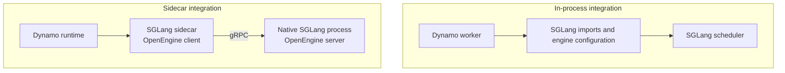

# SGLang Sidecar Adoption

The SGLang sidecar lets Dynamo orchestrate a native SGLang process without
importing SGLang into the Dynamo worker or copying engine configuration into
Dynamo.

## Adoption problem

Teams often have a working SGLang deployment and want to add:

- Dynamo routing and discovery;
- KV-aware worker placement;
- disaggregated prefill and decode;
- lifecycle and cancellation control.

Replacing the engine entrypoint or maintaining a second set of model,
parallelism, and KV flags makes that change a runtime migration. The sidecar
keeps those settings with SGLang.

## Boundary change



The Dynamo sidecar takes one engine-specific setting: the OpenEngine endpoint.
It discovers model identity, role, parallelism, limits, and capabilities from
SGLang.

## Launch shape

Start SGLang in its OpenEngine serve mode:

```bash
python -m sglang.launch_server \
  --model-path <model> \
  --openengine-port 8000
```

Connect the Dynamo sidecar:

```bash
dynamo-sglang-sidecar \
  --openengine-endpoint http://engine:8000
```

`--openengine-host` can set the SGLang bind address. Dynamo runtime options such
as namespace and endpoint name remain sidecar options; model and engine topology
do not.

## Ownership

| Component | Owns |
|---|---|
| Dynamo | Frontend API, routing policy, discovery, KV index, retries, and scaling signals |
| Sidecar | OpenEngine client, request conversion, response conversion, and event ingestion |
| SGLang | Scheduler, tokenizer, detokenizer, KV cache, transfer backend, multimodal processing, and GPU execution |

SGLang maps `GenerateRequest` into its native request path through `PyBridge`.
The scheduler and serving internals remain in SGLang.

## What stays unchanged

- Applications can keep using SGLang's client-facing APIs in deployments that
  do not use the sidecar.
- SGLang still parses engine flags and creates the scheduler processes.
- The scheduler decides batching, cache placement, and token generation.
- SGLang selects and operates the KV-transfer backend.
- OpenEngine support is an opt-in serve mode; it does not replace the project's
  native protocols.

## Protocol scope

OpenEngine standardizes the data Dynamo needs across the process boundary:

- generation streams and stable error categories;
- model, role, topology, and capability discovery;
- health, abort, drain, and load reporting;
- prefill/decode handoff and DP-rank affinity;
- KV connector and event-source discovery.

It does not standardize SGLang's scheduler, radix cache, request dictionaries,
KV-transfer implementation, or native APIs.

## Request paths

- [Disaggregated SGLang request source](diagrams/disagg_request.mmd)
- [Rendered request diagram](diagrams/disagg_request.png)
- [Neutral aggregated request](../diagrams/agg_request.mmd)
- [Cancellation flow](../diagrams/request_cancellation.mmd)

## Adoption stages

1. Start with aggregated generation, discovery, health, abort, and drain.
2. Enable required request features such as logprobs, guided decoding, LoRA, or
   multimodal input.
3. Add prefill/decode roles, KV handoff, rank affinity, and KV events.

The engine advertises feature support. Dynamo can reject unsupported requests
before sending them to a worker.

## Evidence

Existing reports compare the sidecar with Dynamo's in-process SGLang worker:

- [Track B real-engine comparison](benchmarks/benchmark_trackB_sglang_2026-06-12.md)
- [P8/D16 concurrency sweep](benchmarks/benchmark_inferencex_pareto_p8d16_conc4096fix_2026-06-23.md)

These reports describe their hardware, models, and run conditions. They are
point measurements, not general performance guarantees.
